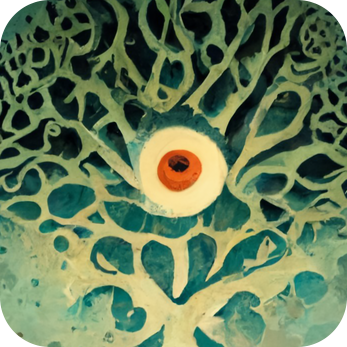

# creative coding sketchbook

A collection of experiments that are periodically uploaded to [instagram](http://instagram.com/natelaffanio) and [vimeo](http://vimeo.com/natelaffanio).  All the ReactThreeFiber sandboxes are at [ccs-sandbox-r3f.web.app](https://ccs-sandbox-r3f.web.app).

Generally speaking, this is an attempt to capture and share the various ways I code creatively. Very much a work in progress, and I apologize for the earlier files - they might not work, as I was just figuring out how all this stuff works.

## Exporting

Export scripts have been moved to `export-scripts/README.md`.

## Notes

Check for big files with `find . -type f -size +5M ! -path '*/node_modules/*'`